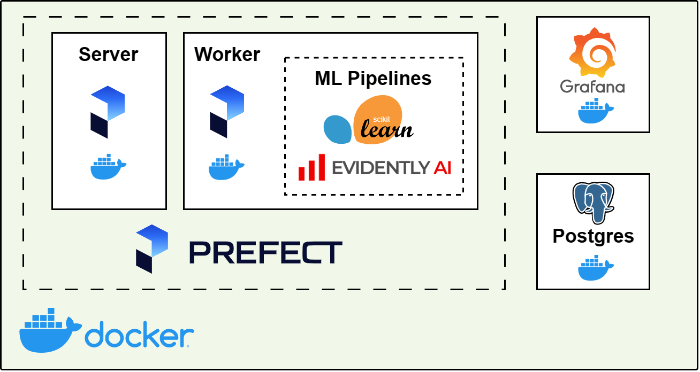

# Module 5: Monitoring with Evidently

Guiding reference: https://github.com/DataTalksClub/mlops-zoomcamp/tree/main/05-monitoring

Datasets: https://www.nyc.gov/site/tlc/about/tlc-trip-record-data.page

General diagram:



## Up and running

Create directories:
- `data/` directory is part of [root .gitignore](/.gitignore)
- `models/` and `reports/` directories are part of [.gitignore](./.gitignore)
```bash
mkdir data models reports
```

Download datasets:
- read downloading instructions in [root README](/README.md)
```bash
chmod +x ../download-data.sh

RAW_DATA_DIR=./data \
VEHICLE_TYPE=green \
YEAR_MONTH_PAIRS='2022-01 2022-02 2023-01 2023-02 2023-03' \
../download-data.sh
```

Prefect considers three components: server, worker, and client. In this setup, you can run server and worker on Docker for easier configuration along with containerized client scripts for setting up work-pool and deployments. Optionally, install cli client for requesting to server instead of using Prefect UI.

### Running Prefect server+worker on Docker

Build services for Prefect server and worker:
```bash
docker compose --profile prefect build
```

Define base environment variables:
```bash
export PREFECT_SERVER_HOST_PORT=4200
export PREFECT_WORK_POOL=docker-process
```

Lift up services:
- WARNING: config in [docker-compose.yaml](./docker-compose.yaml) is for development and/or prototyping, DO NOT USE IT ON PRODUCTION
- Prefect containers take 1-2 minutes to fully setup orchestration, check "prefect_deployments" exits with 0 code
- There are some minors errors on "prefect_server" that are out of the scope of this demo
```bash
docker compose --profile prefect up
```

Browse to services:
- Grafana: [http://localhost:3000](http://localhost:3000)
- Prefect: [http://localhost:4200](http://localhost:4200)

Run parameterized flows considering `/volumes` as directory mount in worker container:
```json
{
  "data_dir": "/volumes/data",
  "models_dir": "/volumes/models",
  "reports_dir": "/volumes/reports",
  "year_month": "2022-01"
}
```

Optionally, install and use Prefect as cli client:
- Create environment:
    ```bash
    python3.8 -m venv venv
    source ./venv/bin/activate
    pip install prefect==2.10.18
    ```
- Deploy flows:
    - [.gitignore](.gitignore) contains `.prefect/`
    ```bash
    export PREFECT_HOME="${PWD}/.prefect"
    prefect config set PREFECT_API_URL=http://127.0.0.1:${PREFECT_SERVER_HOST_PORT}/api

    prefect deployment run build-baseline-main-flow/docker \
        --param data_dir="/volumes/data" \
        --param models_dir="/volumes/models" \
        --param reports_dir="/volumes/reports" \
        --param year_month="2022-01"

    prefect deployment run batch-process-main-flow/docker \
        --param data_dir="/volumes/data" \
        --param models_dir="/volumes/models" \
        --param reports_dir="/volumes/reports" \
        --param year_month="2022-01"
    ```

### Running Prefect server+worker locally

Create environment:
```bash
python3.8 -m venv venv
source ./venv/bin/activate
pip install -U pip pipenv
pipenv install
```

Define base environment variables:
- replicate PREFECT_HOME definition when required
- [.gitignore](.gitignore) contains `.prefect/`
```bash
export PREFECT_HOME="${PWD}/.prefect"
```

Prefect setup:
- setting PREFECT_API_URL config value creates/updates default profile in `"${PREFECT_HOME}/profiles.toml"`
```bash
export PREFECT_HOME="${PWD}/.prefect"
mkdir -p "${PREFECT_HOME}"

# listening on default localhost:4200
prefect config set PREFECT_API_URL=http://127.0.0.1:4200/api
prefect server start

# listening all interfaces on custom port
CUSTOM_PORT=
prefect config set PREFECT_API_URL="http://127.0.0.1:${CUSTOM_PORT}/api"
prefect server start --host 0.0.0.0 --port "${CUSTOM_PORT}"
```

Lift up services:
- WARNING: config in [docker-compose.yaml](./docker-compose.yaml) is for development, DO NOT USE IT ON PRODUCTION
- database service is required by [batch_process_flow.py](./src/batch_process_flow.py) for exporting metrics and by Grafana service for visualization
```bash
docker compose up
```

Optionally, use `psql` to verify correct working:
```bash
PGPASSWORD=example psql -d mlops -h localhost -U postgres -c "\dt"
```

Running flows directly:
- each execution will register one flow run in Prefect
```bash
export PREFECT_HOME="${PWD}/.prefect"

# build baseline model and data reference
python src/build_baseline_flow.py \
    --data-dir "${PWD}/data" \
    --models-dir "${PWD}/models" \
    --reports-dir "${PWD}/reports" \
    --year-month 2022-01

# batch process one month day-by-day
python src/batch_process_flow.py \
    --data-dir "${PWD}/data" \
    --models-dir "${PWD}/models" \
    --reports-dir "${PWD}/reports" \
    --year-month 2022-02
```

Creating work-pool and starting worker:
```bash
export PREFECT_HOME="${PWD}/.prefect"
prefect work-pool create --type process ml-process
prefect worker start --pool ml-process
```

Deploying flows:
```bash
# registering deployment using Python API
python pipelines/src/deployments.py \
    --name 'local' \
    --pool-name ml-process

prefect deployment run build-baseline-main-flow/local \
    --param data_dir="${PWD}/data" \
    --param models_dir="${PWD}/models" \
    --param reports_dir="${PWD}/reports" \
    --param year_month="2022-01"

prefect deployment run batch-process-main-flow/local \
    --param data_dir="${PWD}/data" \
    --param models_dir="${PWD}/models" \
    --param reports_dir="${PWD}/reports" \
    --param year_month="2022-02"
```

Optionally, run query to watch updating of metrics:
```bash
watch -n 5 'PGPASSWORD=example psql -d mlops -h localhost -U postgres -c "select * from metrics order by timestamp desc limit 5"'
```

### Cleaning

Removing services:
```bash
docker compose down --volumes --remove-orphans
```

Remove directories and environment (if created):
```bash
rm -r .prefect data models reports venv
```

## Development

Debugging notes:
- Create a `.env` file for VSCode loading environment variables:
    - [Python Extension](https://marketplace.visualstudio.com/items?itemName=ms-python.python) is required
    - `.env` file is required to be at IDE root workspace
    - restarting IDE is required for applying changes in `.env` file
    ```bash
    cat << EOF > .env
    PREFECT_HOME="${PWD}/module-5/.prefect"
    PREFECT_WORK_POOL=docker-process
    EOF
    ```
- Add arguments to custom debugging launch config at `${wofkspace}/.vscode/launch.json`:
    ```json
    {
        "version": "0.2.0",
        "configurations": [
            {
                "name": "Run with dir args",
                "type": "python",
                "request": "launch",
                "program": "${file}",
                "console": "integratedTerminal",
                "justMyCode": true,
                "args": [
                    "--data-dir", "~/dtc-mlops-course/module-5/data",
                    "--models-dir", "~/dtc-mlops-course/module-5/models",
                    "--reports-dir", "~/dtc-mlops-course/module-5/reports",
                    "--year-month", "2022-01"
                ]
            }
        ]
    }
    ```

## Notes on homework

Filtering raw dataframe from 2023-03 results in a median different from available options. Use following then:
```python
import pandas as pd

df = pd.read_parquet('data/green_tripdata_2023-03.parquet')
df["day"] = df["lpep_pickup_datetime"].dt.day
medians = df[["day", "fare_amount"]].groupby("day").median()
print(medians)
print(medians.max())
```
